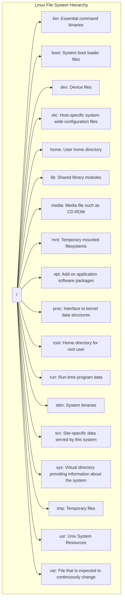

    

# Linux-FileOwl
Linux kernel subsystem that monitors file system events. It can be used to detect when files are created, modified, or deleted

    
    &nbsp;
    
    &nbsp;
    
    

---
---

Linux File System Hierarchy

##

### Contributing

[Contributions of any kind welcome, just follow the guidelines](contributing.md)!

### Contributors

[Thanks goes to these contributors](https://github.com/cybersecurity-dev/Linux-FileOwl/graphs/contributors)!

[🔼 Back to top](#linux-fileowl)
